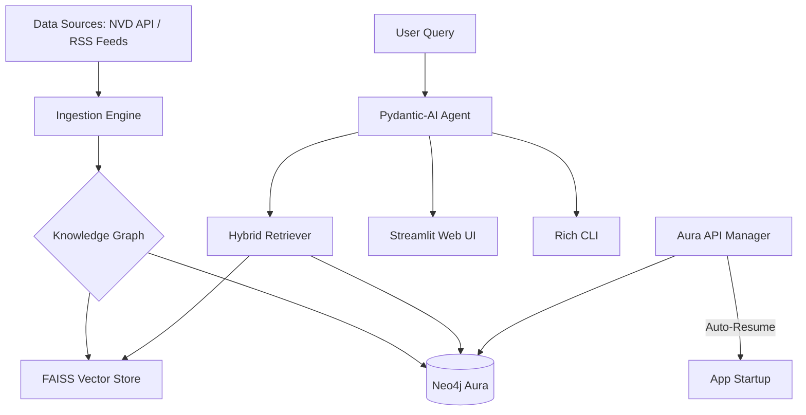

# 🛡️ Cybersecurity Threat Intelligence System

[![Cybersecurity Threats]](https://www.miniorange.com/blog/assets/2025/types-of-cyber-threats.webp)

[](https://neo4j.com/)
[](https://github.com/pydantic/pydantic-ai)
[](https://github.com/getgraphiti/graphiti)
[](https://streamlit.io/)

A state-of-the-art **Cybersecurity Threat Intelligence Agent** built using a hybrid RAG (Retrieval-Augmented Generation) and **Temporal Knowledge Graph** architecture. This system automatically ingests, indexes, and reasons over critical vulnerabilities (CVEs) and global security news to provide actionable intelligence.

---

## 🚀 Key Features

*   **Temporal Knowledge Graph**: Utilizes `graphiti-core` and **Neo4j** to build an evolving map of threat actors, vulnerabilities, and attack campaigns.
*   **AI Reasoning Agent**: Powered by **Pydantic-AI** and GPT-4o-mini, providing structured, reliable, and deeply contextual answers.
*   **Automated Data Ingestion**:
    *   **NVD CVE API**: Fetches the 50 most recent CRITICAL vulnerabilities.
    *   **Security RSS Feeds**: Real-time monitoring of KrebsOnSecurity and other top-tier feeds.
*   **Dual Interface**:
    *   💻 **Rich CLI**: A beautiful terminal-based interface for rapid querying.
    *   🌐 **Streamlit Dashboard**: A modern web UI with interactive graph visualizations.
*   **Aura Instance Management**: Built-in support for the Neo4j Aura API to automatically **resume paused databases** on application startup.
*   **Interactive Topology**: Dynamic visualization of the threat graph using `pyvis`, with adaptive light/dark mode support.

---

## 🏗️ Architecture



---

## 🛠️ Prerequisites

*   **Python 3.11+**
*   **Neo4j Aura Account**: A free or professional instance of Neo4j Aura.
*   **OpenAI API Key**: For agent reasoning and embeddings.
*   **Aura API Credentials**: (Optional) For automated database management.

---

## 📦 Installation

1.  **Clone the repository**:
    ```bash
    git clone https://github.com/SayamAlt/Cybersecurity-Threat-Intelligence-System-using-Neo4j-Graphiti-and-Pydantic-AI.git
    cd Cybersecurity-Threat-Intelligence-System-using-Neo4j-Graphiti-and-Pydantic-AI
    ```

2.  **Install dependencies**:
    We recommend using `uv` for lightning-fast package management:
    ```bash
    uv sync
    # OR using pip
    pip install -r requirements.txt
    ```

---

## ⚙️ Configuration

Create a `.env` file in the root directory (or use Streamlit Secrets):

```env
# Neo4j Connection
NEO4J_URI = "neo4j+s://your-instance-id.databases.neo4j.io"
NEO4J_USER = "neo4j"
NEO4J_PASSWORD = "your-password"
NEO4J_DATABASE = "neo4j"

# LLM Provider
OPENAI_API_KEY = "sk-proj-..."

# (Optional) Neo4j Aura API - For auto-resuming paused instances
AURA_CLIENT_ID = "your-client-id"
AURA_CLIENT_SECRET = "your-client-secret"
AURA_INSTANCE_ID = "your-instance-id"
```

---

## 🖥️ How to Run

### 1. Web Application (Recommended)
Launch the interactive dashboard:
```bash
streamlit run app.py
```

### 2. Command Line Interface
Run the agent directly in your terminal:
```bash
python main.py
```

---

## 🛡️ Automated Database Management

One of the unique features of this system is its **Cloud-Native Resilience**. Since Neo4j Aura Free instances pause after inactivity, the system includes a management layer (`core/aura_api.py`) that:
1.  **Detects status** on startup via the Aura API.
2.  **Triggers a Resume** if the instance is paused.
3.  **Polls until Online** before allowing the AI agent to connect.

This ensures the system is always ready to serve intelligence without manual intervention.

---

## 🗺️ Project Structure

*   `app.py`: The Streamlit web application.
*   `main.py`: The CLI application entry point.
*   `graphiti_rag_agent.py`: Core AI logic and tool definitions.
*   `core/`: Internal logic for Aura management and entity extraction.
*   `ingestion/`: Scripts for data fetching and graph/RAG indexing.
*   `html_files/`: Generated graph visualizations.

---

## 📄 License

This project is licensed under the **Apache License 2.0**. See the [LICENSE](LICENSE) file for details.

---

## 🤝 Contributing

Contributions are welcome! If you have ideas for new data sources (e.g., MITRE ATT&CK, Shodan integration) or improvements to the graph schema, feel free to open a Pull Request.

---

**Developed with ❤️ for the Cybersecurity Community.**
